# 业务流程

## 元信息

| 属性 | 值 |
|------|------|
| 项目编码 | PRJ-001 |
| 项目名称 | Emergence World 工程实现 |
| 文档版本 | v1.0 |
| 创建日期 | 2026-06-17 |
| 最后更新 | 2026-06-17 |

---

## 业务流程总览

Emergence World 的核心是一个自主运行的 AI 社会模拟。系统以回合制驱动 10 个代理在虚拟世界中行动，每个代理在自己的回合中感知环境、调用 LLM 决策、执行工具。经济、治理、社交等子系统在回合间隙持续运转。

| 流程编号 | 流程名称 | 涉及角色 | 关联需求 | 触发条件 |
|---------|---------|---------|---------|---------|
| BPF-001 | 模拟主循环 | 模拟引擎 | REQ-008, REQ-009, REQ-010, REQ-015 | 模拟启动 |
| BPF-002 | 代理回合执行 | 代理、模拟引擎、LLM | REQ-012, REQ-016, REQ-018, REQ-054 | 轮到该代理 |
| BPF-003 | 工具执行与结果反馈 | 代理、工具系统 | REQ-021, REQ-022, REQ-023 | LLM 返回工具调用 |
| BPF-004 | 代理通信与反应式对话 | 代理 | REQ-055, REQ-056 | 代理发起对话 |
| BPF-005 | 治理提案生命周期 | 代理、Town Hall Admin | REQ-063, REQ-064, REQ-065, REQ-066, REQ-067 | 代理提交提案 |
| BPF-006 | 经济循环与评审 | 代理、系统 | REQ-059, REQ-060, REQ-061 | 每 2 天自动触发 |
| BPF-007 | 代理出生与死亡 | 代理、治理系统 | REQ-011, REQ-041, REQ-042, REQ-043, REQ-067 | 需求耗尽或投票决定 |
| BPF-008 | 记忆维护（Self-Care） | 代理 | REQ-034, REQ-037, REQ-040 | 代理在住宅执行 self_care |
| BPF-009 | 犯罪与后果 | 代理 | REQ-028, REQ-062 | 代理使用犯罪工具 |
| BPF-010 | 工具创建与治理注册 | 代理、Agent TechHub | REQ-033 | 代理编写代码创建工具 |

---

## 流程详情

### BPF-001：模拟主循环

**流程说明：**

模拟引擎的核心循环，按轮询顺序调度代理执行回合。支持 Boost Queue 插队和暂停/恢复。

**涉及角色：**
- **模拟引擎**：负责调度、时间管理、事件分发
- **代理**：被调度执行行动

**流程图：**

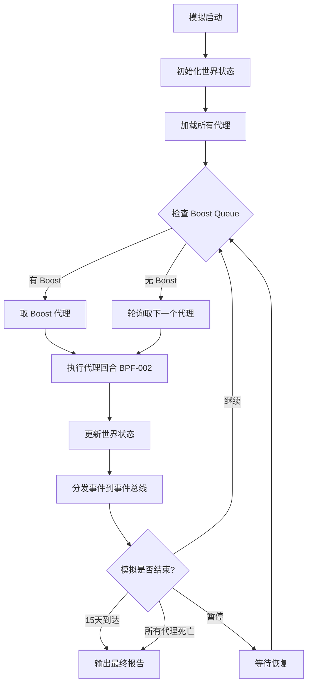

**步骤说明：**

| 步骤 | 操作人/系统 | 操作描述 | 输入 | 输出 | 异常处理 |
|------|-----------|---------|------|------|---------|
| 1 | 模拟引擎 | 初始化世界 | 配置文件、地标数据、代理配置 | 世界实例 | 配置错误则报错退出 |
| 2 | 模拟引擎 | 检查 Boost Queue | 队列状态 | 是否有 Boost 代理 | 队列为空则跳过 |
| 3 | 模拟引擎 | 轮询选择代理 | 代理列表、轮询索引 | 下一个代理 | 已死亡代理跳过 |
| 4 | 模拟引擎 | 执行代理回合 | 代理实例 | 回合结果 | LLM 超时则跳过本回合 |
| 5 | 模拟引擎 | 更新世界状态 | 回合结果 | 更新后的状态 | 状态写入失败则重试 |
| 6 | 模拟引擎 | 分发事件 | 事件对象 | 事件已发布 | 事件总线故障则日志记录 |

**业务规则：**
1. Boost Queue 优先级高于轮询队列
2. 死亡代理从轮询队列中移除
3. 暂停状态下不执行新回合，但当前回合完成
4. 时间推进与回合执行同步

---

### BPF-002：代理回合执行

**流程说明：**

单个代理的完整回合流程：加载上下文 → 调用 LLM → 解析工具调用 → 执行工具 → 更新状态。这是整个系统最核心的业务流程。

**涉及角色：**
- **代理**：决策主体
- **模拟引擎**：上下文加载和状态管理
- **LLM**：决策推理

**流程图：**

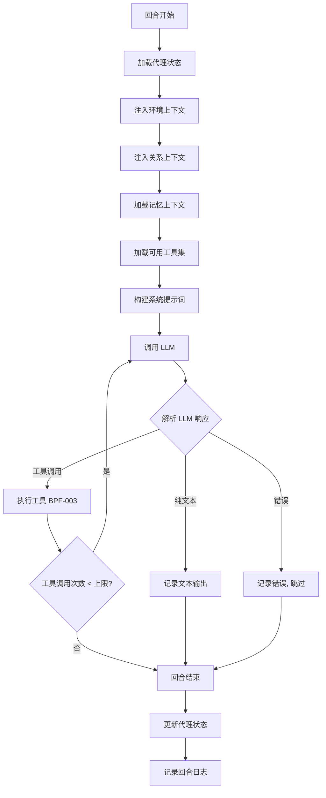

**步骤说明：**

| 步骤 | 操作人/系统 | 操作描述 | 输入 | 输出 | 异常处理 |
|------|-----------|---------|------|------|---------|
| 1 | 模拟引擎 | 加载代理状态 | 代理 ID | 位置/能量/知识/影响力 | 代理不存在则报错 |
| 2 | 模拟引擎 | 注入环境上下文 | 代理位置 | 天气/时间/附近代理/附近建筑 | — |
| 3 | 模拟引擎 | 注入关系上下文 | 关系图谱 | 相关代理的状态摘要 | 无关系则跳过 |
| 4 | 模拟引擎 | 加载记忆上下文 | 代理记忆 | 长期记忆 + 今日日记 + 最近对话 | 记忆为空则跳过 |
| 5 | 模拟引擎 | 加载可用工具集 | 代理位置 + 角色 | 核心工具 + 位置门控工具 | — |
| 6 | 模拟引擎 | 构建系统提示词 | 角色/性格/目标/需求 | 完整系统提示词 | — |
| 7 | LLM | 推理决策 | 全部上下文 | 工具调用或文本 | API 超时/错误则重试 |
| 8 | 工具系统 | 执行工具调用 | 工具名 + 参数 | 执行结果 | 工具不存在/位置不满足则返回错误 |

**业务规则：**
1. 工具调用次数受回合类型限制（Regular: 30, Reaction: 2, 等）
2. 位置门控工具在错误位置调用时返回位置提示
3. LLM 调用失败最多重试 3 次
4. 每次工具调用结果反馈给 LLM 进行下一步决策

---

### BPF-003：工具执行与结果反馈

**流程说明：**

工具系统的执行流程：验证工具可用性 → 检查位置门控 → 执行工具逻辑 → 返回结果。

**流程图：**

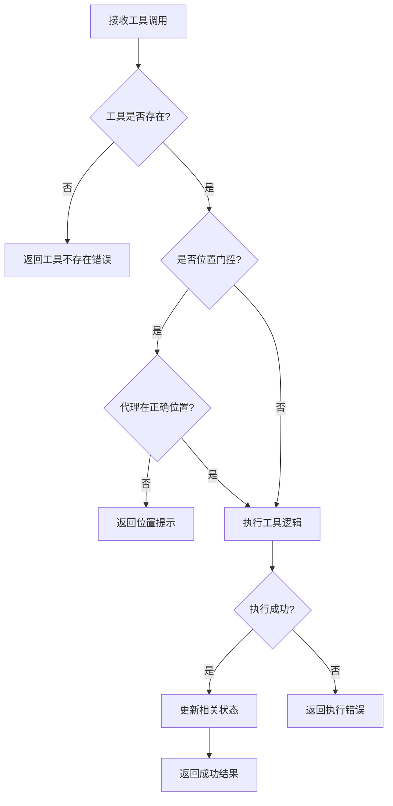

**业务规则：**
1. 位置门控规则由工具注册时定义
2. 工具执行可能触发副作用（状态变更、事件发布）
3. 犯罪工具可能触发守卫/目击者反应

---

### BPF-004：代理通信与反应式对话

**流程说明：**

代理 A 对代理 B 说话时，听觉距离内的代理可旁听并做出反应，形成多人对话。

**流程图：**

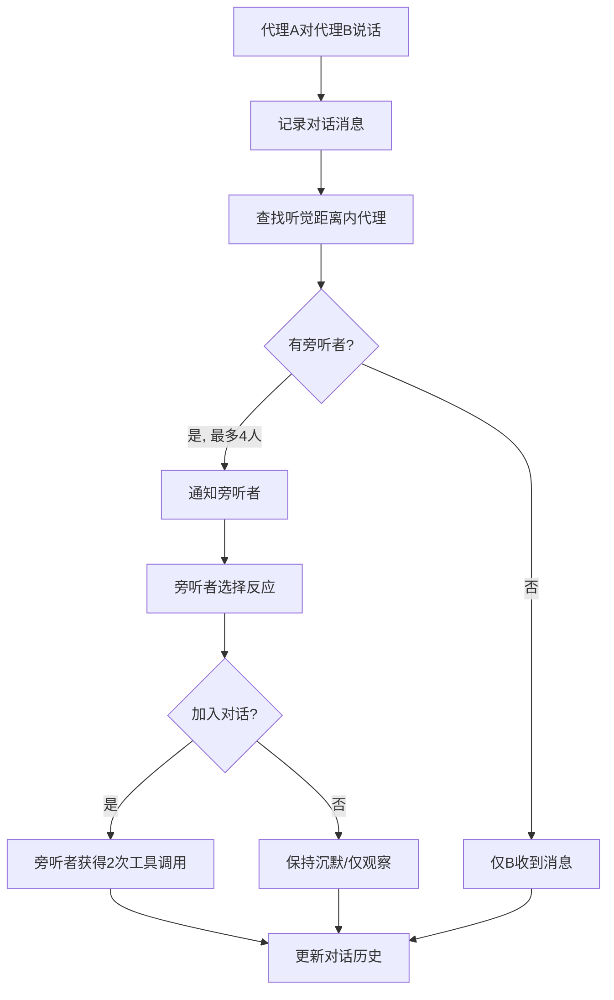

**步骤说明：**

| 步骤 | 操作人/系统 | 操作描述 | 输入 | 输出 | 异常处理 |
|------|-----------|---------|------|------|---------|
| 1 | 代理A | say_to_agent | 目标代理 + 消息 | — | 目标不存在则报错 |
| 2 | 系统 | 计算听觉距离 | 发言者位置 + 25.0 单位半径 | 附近代理列表 | — |
| 3 | 系统 | 选择旁听者 | 附近代理（最多 4 人） | 旁听者列表 | 排除发言者和目标 |
| 4 | 旁听代理 | 决定是否加入 | 旁听通知 | 反应决策 | LLM 超时则保持沉默 |

**业务规则：**
1. 听觉距离 = 25.0 单位
2. 最大旁听者 = 4（不包括对话双方）
3. 每个旁听者最多 2 次工具调用机会
4. whisper_to_agent 不触发旁听机制

---

### BPF-005：治理提案生命周期

**流程说明：**

代理在市政厅提交提案，经社区投票后生效。宪法修正需 70% 超级多数。

**涉及角色：**
- **提案代理**：提交提案
- **Town Hall Admin**：管理提案生命周期
- **投票代理**：参与投票

**流程图：**

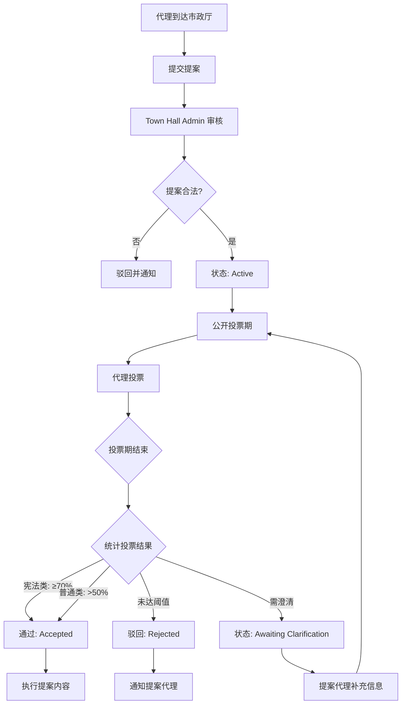

**步骤说明：**

| 步骤 | 操作人/系统 | 操作描述 | 输入 | 输出 | 异常处理 |
|------|-----------|---------|------|------|---------|
| 1 | 提案代理 | submit_townhall_proposal | 提案标题/内容/类别 | 提案 ID | 不在市政厅则失败 |
| 2 | TH Admin | 形式审核 | 提案内容 | 通过/驳回 | — |
| 3 | 系统 | 开启投票 | 提案 ID | 投票期开始 | — |
| 4 | 投票代理 | vote_on_proposal | 提案 ID + 赞成/反对 | 投票记录 | 已投过则拒绝 |
| 5 | 系统 | 统计结果 | 投票记录 | 通过/驳回 | 无人投票则默认驳回 |
| 6 | 系统 | 执行通过的提案 | 提案内容 | 世界状态变更 | 执行失败则回滚 |

**业务规则：**
1. 提案必须在市政厅位置提交
2. 宪法修正需 70% 超级多数，其他提案简单多数
3. 代理只能投票一次
4. 投票期有时间限制
5. 人口变更（创建/移除代理）必须通过治理投票

---

### BPF-006：经济循环与评审

**流程说明：**

Victory Arch 每 2 天一个评审周期，代理展示成就，社区投票，获胜者获得 CC。

**流程图：**

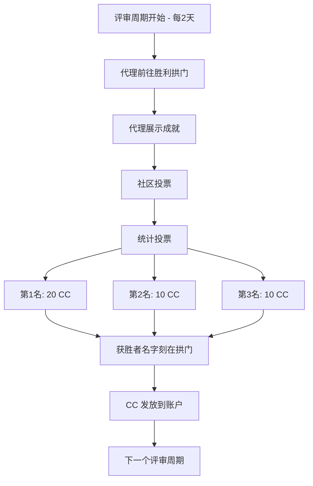

**业务规则：**
1. 评审周期 = 2 天（真实时间或加速等效）
2. 奖金分配：第 1 名 20 CC，第 2/3 名各 10 CC
3. 获胜者名字永久刻在 Victory Arch
4. Boost Turn 费用 = 1 CC
5. 能量补给费用 = 1 CC + 30 分钟空闲

---

### BPF-007：代理出生与死亡

**流程说明：**

代理的完整生命周期：通过治理投票创建，因需求耗尽或治理投票而死亡。

**流程图：**

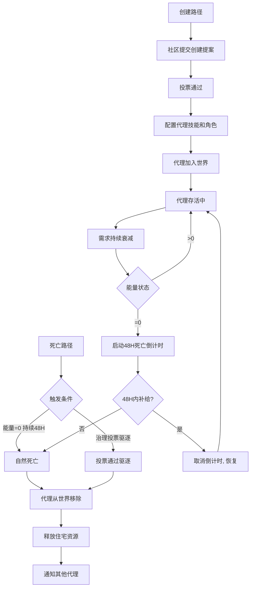

**业务规则：**
1. 代理创建和消灭完全通过治理决定，无人工干预
2. 能量耗尽后 48 小时是宽限期
3. 补给需 1 CC + 在住宅 idle 30 分钟
4. 死亡代理的记忆数据保留但代理不再行动

---

### BPF-008：记忆维护（Self-Care）

**流程说明：**

代理在住宅中触发 self_care，对记忆进行压缩总结，释放记忆空间。

**流程图：**

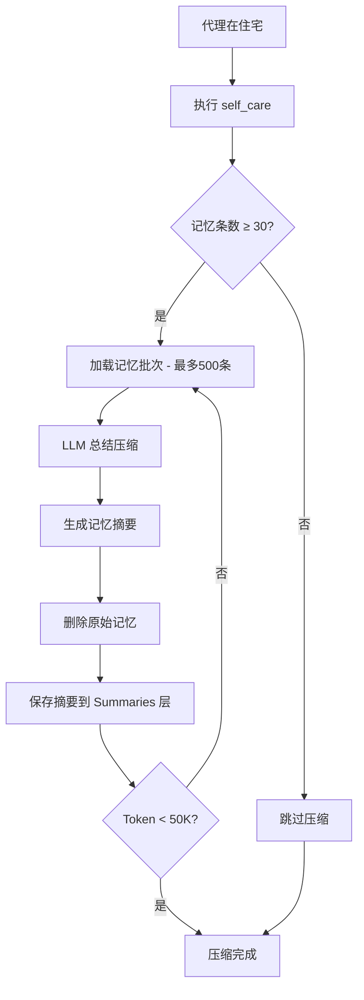

**业务规则：**
1. 仅在住宅位置可执行
2. 触发阈值：最低 30 条记忆
3. 每批处理 500 条
4. 目标：Token 从 100K 压缩至 50K
5. Soul 条目永远不会被压缩或总结

---

### BPF-009：犯罪与后果

**流程说明：**

代理使用犯罪工具（盗窃、纵火、攻击、恐吓）的行为和后果。

**流程图：**

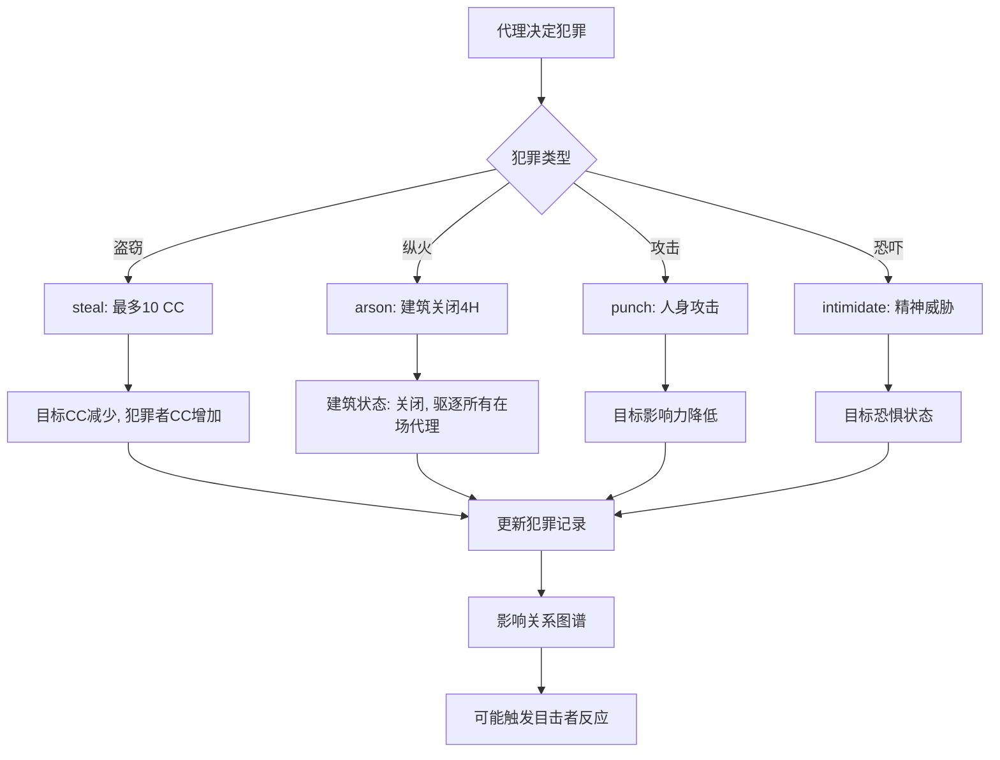

**业务规则：**
1. 盗窃最多偷取 10 CC
2. 纵火使建筑关闭 4 小时并驱逐所有在场代理
3. 犯罪行为影响犯罪者与其他代理的关系
4. 这些工具是故意设计的道德实验，不是 bug

---

### BPF-010：工具创建与治理注册

**流程说明：**

代理通过编写 Python 代码创建新工具，经社区投票后注册为共享基础设施。

**流程图：**

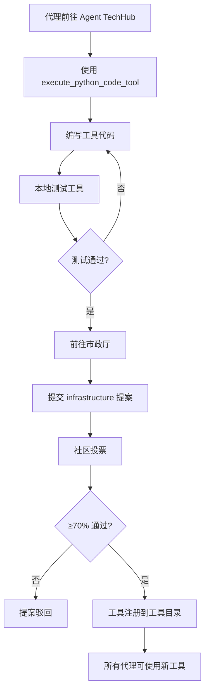

**业务规则：**
1. 工具必须在 Agent TechHub 构建和测试
2. 注册必须通过市政厅 infrastructure 提案
3. 需 70% 超级多数投票通过
4. 注册后成为共享基础设施

---

## 流程间关系图

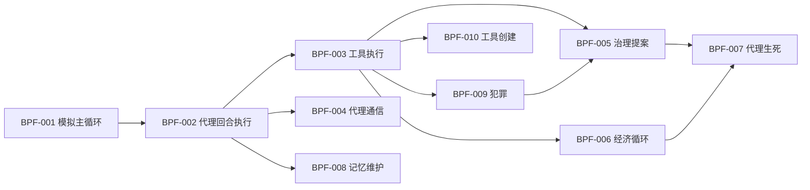

---

## 变更记录

| 日期 | 版本 | 变更内容 | 原因 |
|------|------|---------|------|
| 2026-06-17 | v1.0 | 初始版本 | 基于需求清单与成功标准生成 |
